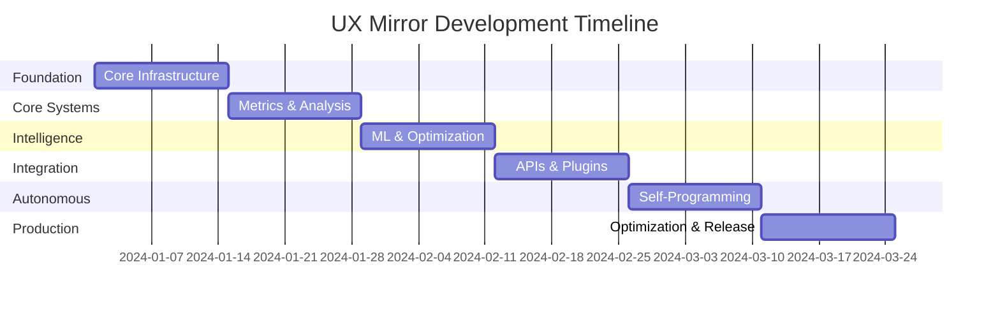

# UX Mirror Project Roadmap

## Vision
Create an autonomous GPU-accelerated UX intelligence system that continuously monitors, analyzes, and optimizes user experiences through self-programming capabilities.

## Project Phases

### Phase 1: Foundation (Weeks 1-2) 🏗️

#### Goals
- Establish core infrastructure
- Set up development environment
- Create basic GPU interop

#### Milestones
- [ ] Repository structure created
- [ ] CI/CD pipeline configured
- [ ] Basic Vulkan-HIP shared memory working
- [ ] Initial documentation complete
- [ ] Community channels established

#### Key Deliverables
1. **Core Infrastructure**
   - Vulkan 1.3 initialization
   - HIP/CUDA context creation
   - Shared memory allocation
   - Basic synchronization

2. **Development Tools**
   - CMake build system
   - Testing framework
   - Code formatting tools
   - Documentation generation

### Phase 2: Core Systems (Weeks 3-4) 💻

#### Goals
- Implement metrics collection
- Create analysis pipeline
- Build agent framework

#### Milestones
- [ ] Real-time metrics collection operational
- [ ] Basic visual analysis working
- [ ] Agent communication established
- [ ] Performance benchmarks created

#### Key Deliverables
1. **Metrics System**
   - Lock-free circular buffers
   - Binary serialization
   - GPU timestamp collection
   - Data aggregation

2. **Analysis Engine**
   - Pattern recognition
   - Statistical analysis
   - Anomaly detection
   - Performance correlation

### Phase 3: Intelligence Layer (Weeks 5-6) 🧠

#### Goals
- Implement ML models
- Create optimization engine
- Build feedback systems

#### Milestones
- [ ] User behavior models trained
- [ ] Optimization algorithms implemented
- [ ] Feedback loop established
- [ ] A/B testing framework ready

#### Key Deliverables
1. **Machine Learning**
   - Clustering algorithms
   - Predictive models
   - Recommendation system
   - Anomaly detection

2. **Optimization Engine**
   - Code generation
   - Performance tuning
   - Layout optimization
   - Accessibility improvements

### Phase 4: Integration (Weeks 7-8) 🔗

#### Goals
- Create plugin system
- Build application APIs
- Implement examples

#### Milestones
- [ ] Plugin architecture complete
- [ ] REST/gRPC APIs functional
- [ ] Example applications working
- [ ] Documentation comprehensive

#### Key Deliverables
1. **Integration Layer**
   - Plugin framework
   - API endpoints
   - SDK libraries
   - Migration tools

2. **Example Applications**
   - Web dashboard
   - Game integration
   - Desktop monitor
   - Mobile SDK

### Phase 5: Autonomous Features (Weeks 9-10) 🤖

#### Goals
- Enable self-programming
- Implement auto-optimization
- Create learning systems

#### Milestones
- [ ] Code generation working
- [ ] Auto-deployment functional
- [ ] Learning algorithms active
- [ ] Feedback validated

#### Key Deliverables
1. **Self-Programming**
   - AST manipulation
   - Code synthesis
   - Hot reloading
   - Version control

2. **Autonomous Systems**
   - Self-optimization
   - Auto-scaling
   - Predictive maintenance
   - Continuous learning

### Phase 6: Production Ready (Weeks 11-12) 🚀

#### Goals
- Performance optimization
- Security hardening
- Documentation completion
- Community building

#### Milestones
- [ ] Performance targets met
- [ ] Security audit passed
- [ ] Documentation complete
- [ ] v1.0 released

#### Key Deliverables
1. **Production Features**
   - Multi-GPU support
   - Cloud deployment
   - Enterprise features
   - Monitoring tools

2. **Community**
   - Contributor guide
   - Tutorial series
   - Example gallery
   - Support channels

## Success Metrics

### Technical Metrics
- **Performance**: <16ms latency, >60 FPS
- **Scalability**: Support 10K+ concurrent users
- **Reliability**: 99.9% uptime
- **Efficiency**: <5% overhead

### Community Metrics
- **Contributors**: 50+ active contributors
- **Adoption**: 1000+ installations
- **Engagement**: 100+ GitHub stars
- **Documentation**: 90% API coverage

### Impact Metrics
- **UX Improvement**: 25% better engagement
- **Performance Gains**: 30% faster interfaces
- **Accessibility**: WCAG 2.1 AA compliance
- **Developer Productivity**: 40% faster iteration

## Risk Mitigation

### Technical Risks
1. **GPU Compatibility**
   - Mitigation: Support multiple backends
   - Fallback: CPU implementation

2. **Performance Overhead**
   - Mitigation: Aggressive optimization
   - Fallback: Configurable features

3. **Integration Complexity**
   - Mitigation: Clear APIs
   - Fallback: Standalone mode

### Community Risks
1. **Low Adoption**
   - Mitigation: Strong documentation
   - Strategy: Conference talks

2. **Contributor Burnout**
   - Mitigation: Clear guidelines
   - Strategy: Recognition program

## Long-term Vision (6+ Months)

### Advanced Features
- Neural architecture search for UI
- Cross-platform design system generation
- Automated accessibility remediation
- Real-time collaboration features

### Ecosystem Growth
- Plugin marketplace
- Certification program
- Enterprise support
- Research partnerships

### Technology Evolution
- WebGPU support
- Mobile GPU optimization
- Edge computing integration
- Quantum computing exploration

## Get Involved

### How to Contribute
1. Check our [Contributing Guide](CONTRIBUTING.md)
2. Join our [Discord](https://discord.gg/YOUR_INVITE)
3. Pick an issue labeled `good first issue`
4. Submit your first PR!

### Priority Areas
- Vulkan ray tracing optimization
- HIP kernel development
- ML model implementation
- Documentation writing
- Testing and QA

## Timeline Summary

---

*Last Updated: [Current Date]*
*Version: 0.1.0* 